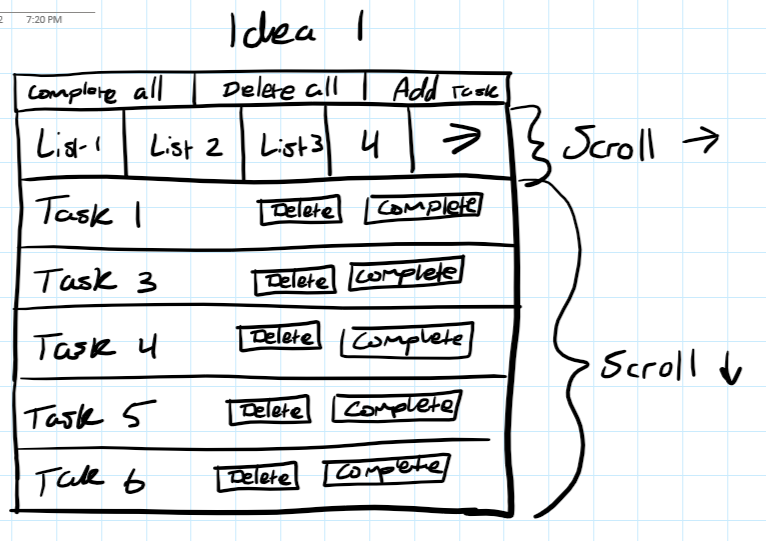
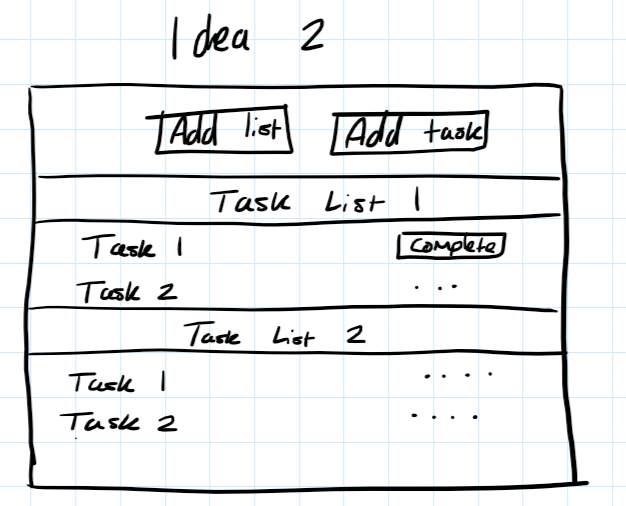
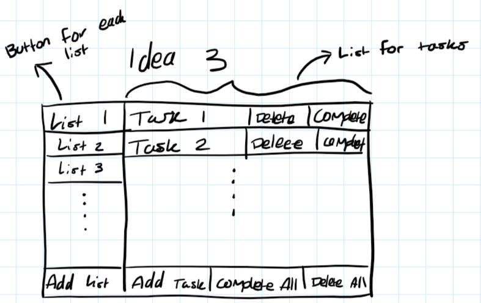
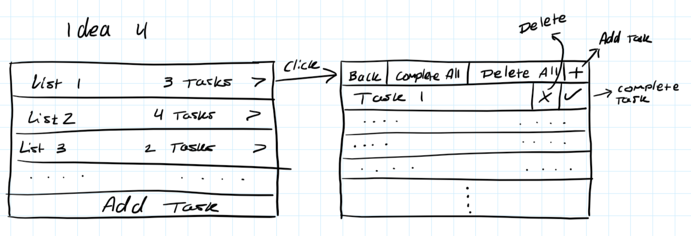
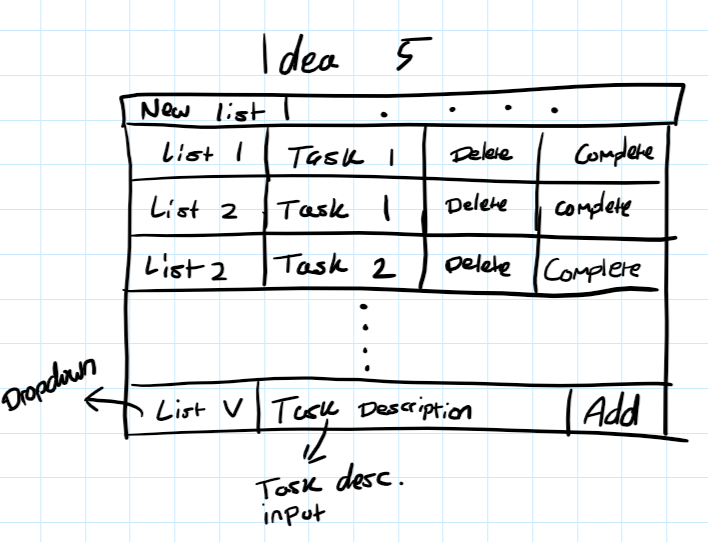
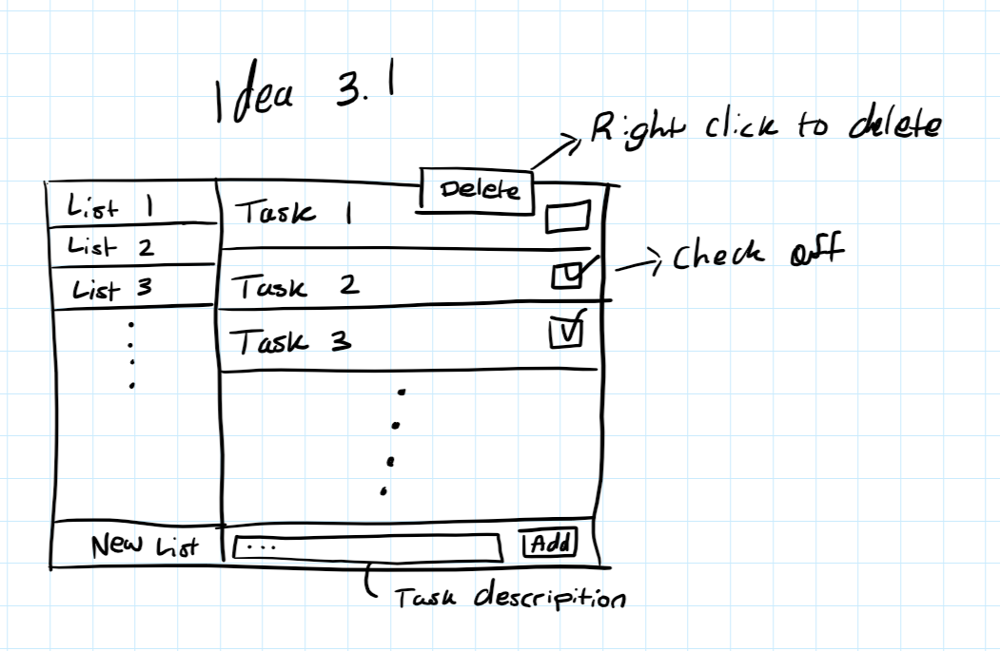
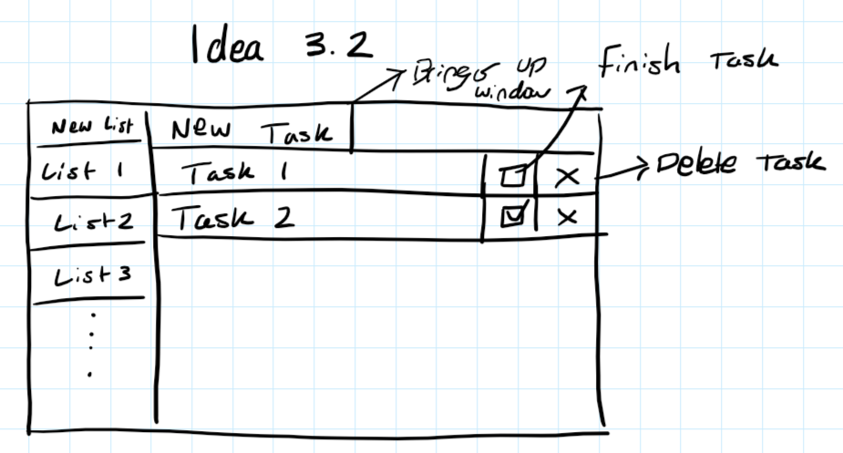
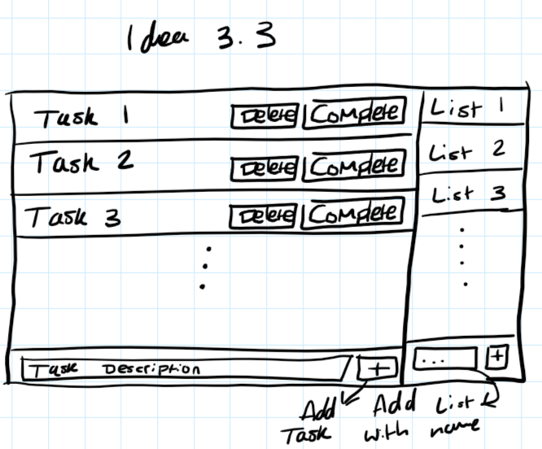

Sketch 1 consists of two separate sroll parts. The top scroll of sublists, and the list of tasks. There's complete all, delete all, and add task buttons. There should also be a add list button.

Sketch 2 has all the tasks shown in one list. Each task is underneath task list headers, preferably colored to stand out. There are simple add list and add task buttons at the top, with complete and delete (not shown) buttons on each task.

Here is the sketch that I decided on. There's sublists on the left with the list of tasks on the right. The UI is intuitive and all elements are close together relative to their use.

This sketch breaks up the list and tasks into two separate windows and takes elements from sketch 3.

Here looks more like a spreadsheet. Each task has a list attached to it (preferably colored for recognition). It also has a dropdown for when you add a task.

Here's the sketch that I decided on. It feels like the cleanest interface. To check off a task, you press a simple button. You right click and can delete tasks/lists and rename them. To add a task, you enter the task description and press the add button. There's also a new list button.

This is essentially the same as sketch 3.1 with some buttons moved around. I also like this sketch but I don't like the idea of a user accidentally deleting a task with the delete task button next to the checkmark. I like the idea of two clicks to delete without a confirmation box.

This is also very similar to the previous sketches, but it feels less clean with the delete/complete buttons with texts. I enjoy the cleanliness of the [+] buttons next to the add task and add description.
